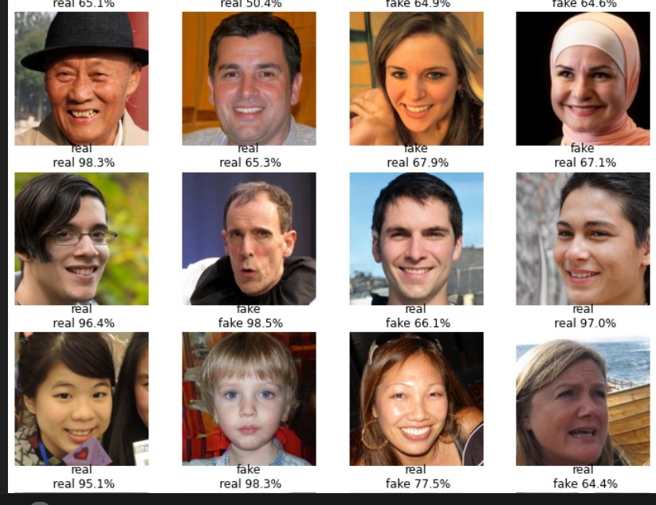

# Real vs Fake Image Detector



## Overview

This repository contains a project aimed at detecting real and fake images using deep learning models. The project utilizes the 140k Real and Fake Faces dataset from Kaggle and implements several state-of-the-art convolutional neural network architectures, including DenseNet, Inception, VGG16, and Xception. Additionally, it employs an ensemble approach combining Inception, VGG16, and Xception to achieve the highest accuracy.

## Dataset

The dataset used in this project is the [140k Real and Fake Faces](https://www.kaggle.com/c/140k-real-and-fake-faces) dataset from Kaggle. It contains a large number of images labeled as either real or fake, providing a comprehensive basis for training and evaluating deep learning models.

## Models

The following models were implemented and evaluated in this project:
- DenseNet
- Inception
- VGG16
- Xception
- Ensemble of Inception, VGG16, and Xception

All models achieved an accuracy greater than 80%, with the ensemble model providing the highest accuracy.

## Notebook

- `Real_and_Fake_Faces.ipynb`: This notebook contains all the steps including data preprocessing, model training, evaluation, and ensemble modeling.

## Results

The table below summarizes the accuracy of each model:

| Model                 | Accuracy  |
|-----------------------|-----------|
| DenseNet              | > 80%     |
| Inception             | > 80%     |
| VGG16                 | > 80%     |
| Xception              | > 80%     |
| Ensemble (Inception, VGG16, Xception) | Highest Accuracy |

## Usage

1. Clone the repository:
    ```bash
    git clone https://github.com/bajajdivya/real-vs-fake-image-detector.git
    cd real-vs-fake-image-detector
    ```

2. Install the required packages:
    ```bash
    pip install -r requirements.txt
    ```

3. Download the dataset from Kaggle and place it in the `data/` directory.

4. Run the notebook:
    - `Real_and_Fake_Faces.ipynb`

## Contributing

Contributions are welcome! Please feel free to submit a Pull Request or open an Issue.

## License

This project is licensed under the MIT License.

## Acknowledgments

- [Kaggle](https://www.kaggle.com) for providing the dataset.
- The creators of DenseNet, Inception, VGG16, and Xception models.
